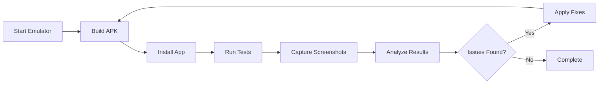
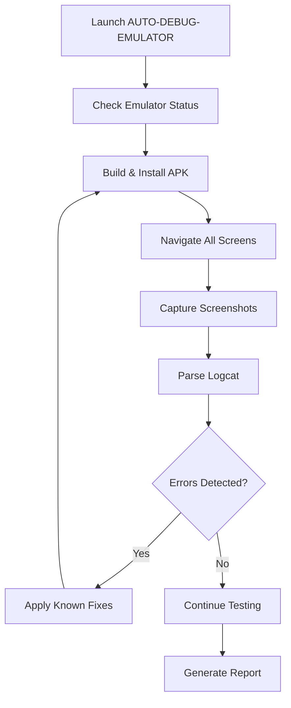

# Squash Training App - Automation Guide

## 🤖 Automation Overview

This guide documents all automation scripts and tools for building, testing, and debugging the Squash Training App.

## 📂 Script Categories

### Production Scripts (`/scripts/production/`)
Essential scripts for daily development and deployment.

### Utility Scripts (`/scripts/utility/`)
Helper tools for common tasks.

### Experimental Scripts (`/archive/scripts/experimental/`)
Historical scripts kept for reference.

## 🚀 Core Automation Scripts

### 1. BUILD-ITERATE-APP.ps1
**Purpose**: Domain-Driven Design (DDD) approach for systematic development
**Features**:
- 50+ iteration cycles
- Automatic error detection and fixing
- Build → Install → Test → Debug cycle
- Comprehensive reporting

```powershell
cd scripts/production
.\BUILD-ITERATE-APP.ps1 -MaxIterations 50 -AutoFix
```

### 2. FINAL-RUN.ps1
**Purpose**: Quick build and run solution
**Features**:
- One-command execution
- Metro bundler management
- Automatic device detection
- Error recovery

```powershell
cd SquashTrainingApp
.\FINAL-RUN.ps1
```

### 3. MCP-FULL-AUTOMATION.ps1
**Purpose**: Complete automation suite
**Features**:
- End-to-end automation
- Multiple device support
- Performance metrics
- HTML reporting

```powershell
cd scripts/production
.\MCP-FULL-AUTOMATION.ps1
```

### 4. AUTO-DEBUG-EMULATOR.ps1 (New)
**Purpose**: Automated emulator debugging with visual verification
**Features**:
- Automatic emulator management
- Screenshot capture at each step
- Crash detection and recovery
- Self-healing mechanisms
- Comprehensive debug reports

```powershell
cd scripts/production
.\AUTO-DEBUG-EMULATOR.ps1 -Cycles 50
```

## 🛠️ Utility Scripts

### START-EMULATOR.ps1
```powershell
# Start Android emulator
cd scripts/utility
.\START-EMULATOR.ps1 -AVD "Pixel_6"
```

### UTIL-FILE-GUARD.ps1
```powershell
# Check before creating new files
cd scripts/utility
.\UTIL-FILE-GUARD.ps1 -FileName "NEW-SCRIPT.ps1" -FileType "script" -Category "BUILD"
```

## 🔄 Automation Workflows

### Standard Development Workflow


### Debug Automation Flow


## 📊 Automation Features

### Error Detection
- **Logcat Parsing**: Real-time error monitoring
- **Screenshot Analysis**: Visual regression testing
- **Performance Metrics**: Memory and CPU usage
- **Crash Detection**: Automatic crash recovery

### Self-Healing Mechanisms
```powershell
# Known error patterns and fixes
$ErrorPatterns = @{
    "OutOfMemoryError" = { Clear-AppCache }
    "NetworkException" = { Reset-NetworkSettings }
    "DatabaseLocked" = { Restart-DatabaseService }
    "UIFreeze" = { Force-UIRefresh }
}
```

### Reporting System
- **HTML Reports**: Visual test results
- **Screenshot Gallery**: Step-by-step visual flow
- **Performance Graphs**: Resource usage over time
- **Error Summary**: Categorized issues

## 🎯 Common Automation Tasks

### Full Test Cycle
```powershell
# Run complete test suite
.\AUTO-DEBUG-EMULATOR.ps1 `
    -Cycles 50 `
    -CaptureScreenshots `
    -GenerateReport `
    -AutoFix
```

### Quick Smoke Test
```powershell
# Basic functionality check
.\QUICK-REAL-TEST.ps1 -Features @("Home", "Checklist", "Record")
```

### Performance Testing
```powershell
# Monitor app performance
.\DEBUG-ALL-FEATURES.ps1 `
    -MonitorPerformance `
    -Duration 300 `
    -OutputMetrics
```

## 🔧 Configuration

### Environment Variables
```powershell
# Set in your PowerShell profile
$env:ANDROID_HOME = "$env:LOCALAPPDATA\Android\Sdk"
$env:JAVA_HOME = "C:\Program Files\Eclipse Adoptium\jdk-17.0.15.6-hotspot"
$env:EMULATOR_NAME = "Pixel_6"
$env:DEBUG_OUTPUT = "C:\Git\Routine_app\debug-results"
```

### Script Parameters
Most scripts support these common parameters:
- `-Verbose`: Detailed output
- `-SkipClean`: Skip cleanup steps
- `-AutoFix`: Apply fixes automatically
- `-MaxRetries`: Maximum retry attempts
- `-Timeout`: Operation timeout in seconds

## 📈 Metrics and Monitoring

### Key Performance Indicators
- **Build Success Rate**: Target 95%+
- **Test Pass Rate**: Target 90%+
- **Average Cycle Time**: <5 minutes
- **Crash Rate**: <1%

### Monitoring Commands
```powershell
# Real-time logcat monitoring
adb logcat | Select-String "squashtrainingapp"

# Performance stats
adb shell dumpsys meminfo com.squashtrainingapp

# Battery usage
adb shell dumpsys batterystats
```

## 🚨 Troubleshooting Automation

### Common Issues

#### Emulator Won't Start
```powershell
# Reset emulator
.\scripts\utility\RESET-EMULATOR.ps1

# Start with verbose logging
$env:ANDROID_EMULATOR_DEBUG = 1
emulator -avd Pixel_6 -verbose
```

#### Build Failures
```powershell
# Clean and retry
.\scripts\production\CLEAN-AND-BUILD.ps1
```

#### Test Timeouts
```powershell
# Increase timeout values
$global:TestTimeout = 300  # 5 minutes
```

## 📚 Best Practices

### Script Development
1. **Always use parameter validation**
2. **Include comprehensive error handling**
3. **Add progress indicators**
4. **Generate detailed logs**
5. **Support dry-run mode**

### Automation Guidelines
1. **Make scripts idempotent**
2. **Use meaningful exit codes**
3. **Capture all relevant data**
4. **Implement retry logic**
5. **Clean up resources**

## 🔮 Future Automation Plans

### Planned Features
- **AI-Powered Error Resolution**: ML-based fix suggestions
- **Visual Regression Testing**: Automated UI comparison
- **Performance Profiling**: Detailed performance analysis
- **Cloud Integration**: Remote test execution
- **CI/CD Pipeline**: GitHub Actions integration

### Upcoming Scripts
- `AI-TEST-GENERATOR.ps1`: Generate test cases using AI
- `PERFORMANCE-PROFILER.ps1`: Deep performance analysis
- `CLOUD-TEST-RUNNER.ps1`: Distributed testing
- `RELEASE-AUTOMATION.ps1`: Automated release process

---

**Last Updated**: 2025-07-14
**Automation Version**: 2.0
**Script Count**: 15+ production scripts